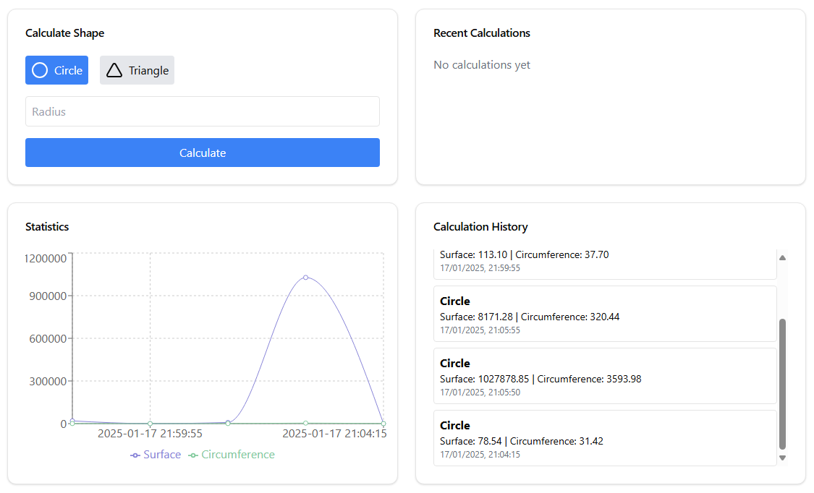

# Geometry API Application



## Description

This application is a simple API built using the Symfony framework. It provides endpoints to calculate the surface area and circumference of geometric shapes, such as circles and triangles. The application also includes a reusable service to perform calculations involving multiple shapes.

## Features

- **Circle Calculations**: Calculate the surface area and circumference of a circle based on its radius.
- **Triangle Calculations**: Calculate the surface area and perimeter of a triangle based on the lengths of its sides.
- **Reusable Service**: A service that can sum the surfaces and circumferences of multiple shapes.
- **JSON Responses**: Provides results in a structured JSON format.

---

## Installation

### Prerequisites

- **PHP**: Version 8.1 or later
- **Composer**
- **Symfony CLI**
- A web server like Apache or Nginx (optional for production)

### Steps

1. Clone the repository:
   ```bash
   git clone <repository-url>
   cd <repository-folder>


Install dependencies:

composer install

Start the Symfony development server:

symfony serve

Access the application at:

http://127.0.0.1:8000

Directory Structure

src/
├── Controller/
│   └── GeometryController.php
├── Model/
│   ├── Circle.php
│   └── Triangle.php
├── Service/
│   └── GeometryCalculator.php
└── Interface/
    └── ShapeInterface.php

Controller/: Contains the logic for handling HTTP requests.

Model/: Represents the geometric shapes and their respective properties.

Service/: Contains reusable logic for calculating sums of surfaces and circumferences.

Interface/: Defines a contract for geometric shapes to ensure consistent method implementation.

Endpoints

Circle Endpoint

GET /circle/{radius}

Request:

Parameter:

radius (float): Radius of the circle

Response:

{
  "type": "circle",
  "radius": 5.0,
  "surface": 78.54,
  "circumference": 31.42
}

Triangle Endpoint

GET /triangle/{a}/{b}/{c}

Request:

Parameters:

a (float): Length of side A

b (float): Length of side B

c (float): Length of side C

Response:

{
  "type": "triangle",
  "a": 3.0,
  "b": 4.0,
  "c": 5.0,
  "surface": 6.0,
  "circumference": 12.0
}

Development Notes

Adding New Shapes

To add a new shape, follow these steps:

Create a new class in the src/Model/ directory and implement the ShapeInterface.

Define the calculateSurface() and calculateCircumference() methods in the class.

Update the controller or create new endpoints if needed.

Testing

Run the Symfony built-in server and test the endpoints using Postman, cURL, or a browser:

Example cURL command for circle:

curl http://127.0.0.1:8000/circle/5

Example cURL command for triangle:
